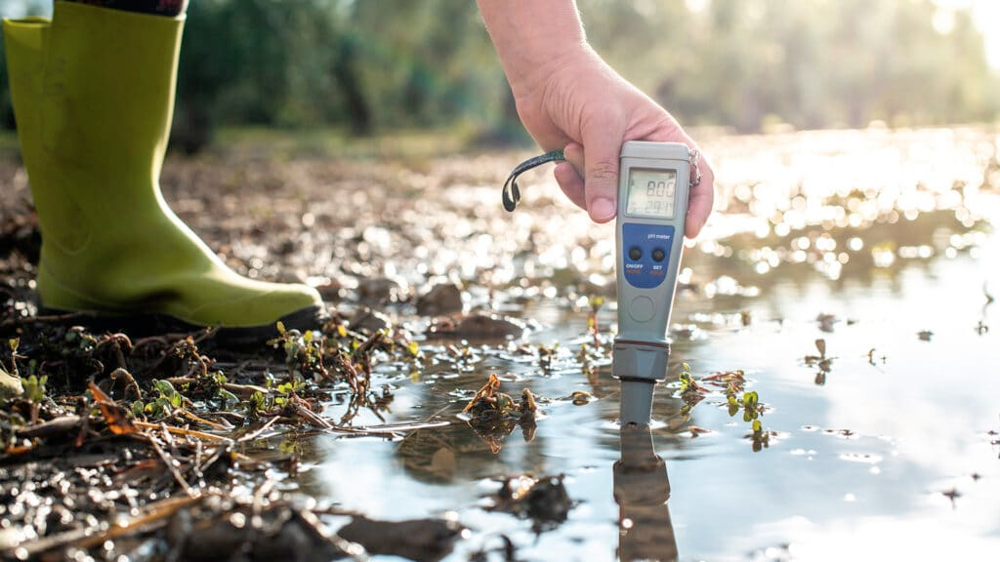

# Sensores 🌡 

<!--
TODO: poner modelo de sensores de referencia.
TODO: poner cosas que salieron mal: medicion presión a 40cm, ...)
TODO: poner fotos de todos los experimentos para todos.
TODO: terminar de analizar íultimos datos.
TODO: poner tabla de resuemn resultados sensores.
-->

Los sensores otorgarán el input de información y de ellos dependerá la calidad de los datos en el sistema. Por esto son de vital importancia dado que mejores datos se espera lleven a mejores estimaciones y alertas. Pero mejores sensores implican un mayor costo, y se espera generar un sistema de monitoreo acequible.

El objetivo entonces es encontrar sensores económico cuya calidad de medición sea la suficiente para operar el sistema, entendiendo que los sensores profesionales por lo general tienen un desempeño y una presición mayor de la necesaria para el análisis de agua.

## Opciones
Se seleccionaron los sensores en la siguiente tabla para medir las variables fisicoquímicas de: Temperatura, Conductividad, pH, Nivel de agua y Turbidez.

| Variable                   | Modelo Sensor                    | Rango                                       | Error                              | Resolución                       |
| -------------------------- | -------------------------------- | ------------------------------------------- | ---------------------------------- | -------------------------------- |
| Tº                         | DS18B20                          | \-10°C - 85°C                               | ±0.5 ºC                            | 0,0625 °C (12 bit)            |
| Presión                    | HK1100C                          | 0 - 1,2 MPa                                 | 1.5% FS                            | 18 kPa 1.8 mt H2O             |
| pH                         | Gravity: Analog pH Sensor/Meter  | 0 - 14 pH                                   | ±0,1 pH                            | 0,014 pH (12 bit)             |
| Conductividad Eléctrica | Gravity: Analog TDS Sensor/Meter | 0 - 1000ppm 0 - 2000 uS/cm 0 - 2mS/cm | ± 10% FS 200 uS/cm 0.2 mS/cm | 1,3 ppm 2,6 uS/cm (12 bit) |
| Turbiedad                  | Grove - Turbidity Sensor/Meter   | 0 - 3000 NTU                                | No indica                          | 4,5 NTU (12 bit)              |

- además se toma en cuenta los voltajes de funcionamiento de los sensores y el protocolo de comunicación.

Por lo general se sometió a los sensores a tipos de pruebas que permitieran evaluar dos dimensiones principales de su comportamiento: (1) su presición y (2) su desempeño por periodos prolongados de sumersión en medio acuático ('sensor drift'). 

## Temperatura

Experimentos demostraron un buen desempeño del sensor en su comportamiento en el tiempo

- comportamiento súper predecible.
- se debe ajustar el offset inicial.
- después de un tiempo se puede observar una leve desviación de la medidas, pero se puede corregir completamente reajustando el offset.
- errores menores a 0.5ºC y 1ºC

TODO: - Colocar sensor de referencia para saber cuál es.

- Error de dos sensores ds18b20 el primer mes de medición:
TODO: (se puede corregir por offset el error 1? indicar que sensores tenían un poco de uso ya?)

- Error de sensores luego de 7 meses de uso. Experimento dura 1 mes.

- Se desarrolla nueva metodología hacia últimos experimentos: ver perfil de medición en el rango. Se observa algo de histéresis en ambos sensores para la bajada.
TODO: (considerar rápidez en la toma de datos, existe histéresis en la bajada de temperatura para cambios rápidos)

## Conductividad

TODO: (fotos del experimento)

- Ojo: Documentación indica rango [0,2000 uS/cm] ([link producto](https://www.dfrobot.com/product-1662.html))

- Perfil de medición luego de 1 mes de experimento:
    - metodología incluye sensor de control.
    - desgaste irrecuperable del sensor sumergido.
    - no se ve histéresis y tampoco en los datos

- Si es importante la saturación sobre los valores ~1500 uS/cm y ~2000 uS/cm.

- Se esperan más experimentos para ver si es por depositos de minerales en el sensor, o si es corregible, o fue un error puntual, o etc.

## pH

TODO: fotos experimento

- no se ve mucha histéresis
- hay harta variación en la calibración pero es posible recalibrarla y los sensores vuelven a funcionar.
- se esperar hacer más experimento para corroborar datos y además poder ir estimando que tan rápido se descalibran los datos, y cuánto se va perdiendo de presición con cada recalibración.

- Perfil inicial del experimento:

- Perfil al final del experimento sin recalibrar:

- Perfil final con recalibración de los sensores:

## Nivel de Agua

- Se utilizan dos sensores para calcular la columna de agua 
- TODO: Poner sensores dereferencia para ambos casos.

- últimos experimentos fueron en baldes de agua y mato, porque muy poca altura asi que el desempeño fue peor, pero este no empeoró luego de 6 meses con sensores sumergidos.

## turbidez

- primeros experimento dieron cualquier cosa, dificultad en uso de sensor muy delicados a la luz y otras variables dificiles de controlar.

- Errores del rango de ~1000 NTU. No confiables, quizás solo apra alertas grandes pero mejor seguir buscando.

