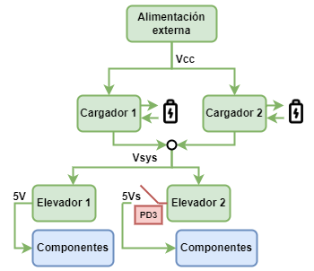
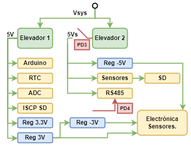
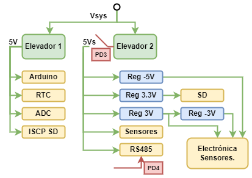
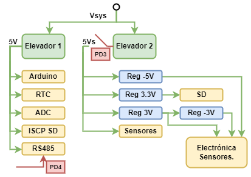

# 💻 Electrónica

## Diseño
El dispositivo de electronica (nodo sensor) diseñado para el monitoreo de de agua en intervalos de tiempo de manera autónoma, esta basado en tomar las medidas con sesores para ser enviadas mediante comunicación serial a un sistema de comunicación para el monitorio de estas características, este dispositivo tomará medidas de pH, Condutividad, turbidez, temperatura y presión.

\*imagen sistema completo resaltando el nodo sensor*

### Prototipo
Como prototipo inicial se realizó un circuito en Arduino para realizar pruebas con sesores, medidas y comunicación para obtener una versión funcional que pudiera enviar los datos.
#### Selección de componentes
Dado lo anterior los componentes que integran este prototipo inicial son los siguientes:

1. Arduino Nano: Microcontrolador principal.
1. ADC: Lectura de señales analógicas a digitales.
1. RTC: Encargado de establecer los tiempo de medidas mediante alarmas y estado de reposo.   
1. Modulo SD para el guardado de los datos medidos.
1. Sensores: Temperatura, conducitividad, pH, Presión y Turbidez. 
1. RS485: Para realizar una comunicación serial de gran alcance(>10m).

Destacar que estos sensores seleccionados se sometieron a una serie de pruebas para comprobar su rendimiento, ver sus limitaciones y desgaste en el tiempo.

Como resultados iniciales se tiene un nodo sensor capaz de obtener medidas de los sensores, guardar estos datos en una microSD y ademas enviar estos datos de manera serial y un prototipo inicial lo suficientemente útil para la realización de pruebas en profundidad y analizar las limitaciones de los sensores.
### PCB
Continuando con las mejoras del del nodo sensor, y el prototipo funcionando de manera adecuada, en conjunto con "MCI electronic" (Frabicante local de PCB y diseño de circuitos), se llevo a cabo la integración completa del prototipo a una PCB con mejoras incluidas dadas principalmente en el sistema de energía:

1. **Cargador de baterías**: Agregar al nodo un circuito de energía que sea alimentado a travéz de baterías de litio 18650 con toda su electrónica para un correcto funcionamiento (Cagardores y elevadores).
1. **On/Off para sensores** Dividir la fuente de energía en una activa (5V) que siempre entrega alimentación al sistema y una de reposo (5Vs) que se apaga cuando el sistema no esta midiendo o enviado datos para aquellos componentes que puedan ser apagados para reducir el consumo lo mayor posible.

La PCB incluye toda la electrónica de sensores y las necesarias  como reguladores de voltaje (-5V,3V,-3V y 3.3V) siendo una pieza completa que se insertan los sensores para tomar las medidas. Posee ademas una conexion FTDI para realizar la programación del microcontrolador.

#### Historial de Versiones

Debido a diversos tipo de situaciones como falta de pistas o distribuciones de los componentes en diferentes fuentes de energía (5V y 5Vs) o simple optimización de esta, se obtuvieron varias versiones de PCB a modo de mejora.

1. **Versión N°1:** La primera placa PCB entrega por "MSI electronic" Con cables en la parte frontal entr el RTC y el microcontrolador.

Detalles:

* Esta versión de la placa posee el pin de medida de la alimentación 5Vs antes la electrónica del "switch" que permite apagarla en reposo.
* Por otro lado la alimentacion 5Vs alimenta el componente de comunicación Rs485 y al regulador de -5V realizando modificaciónes en las fuentes de energía.

**Modificación 1:** Debido a que simplemente la alimentación apagaba el RS485 y un regulador, se realizaron cambios para dejar d en la alimentación de reposo(5Vs) a los sensores y los reguladores faltantantes que seran utilizados solamente en medida y envío de datos. Para ello se cortó una pista separando los reguladores y sensores con la alimentacion continua (5V) y se agregó un cable para alimentarlos con 5Vs.

Como resultados trajo mejoras en el consumo.

**Modificación 2**: Se procedió a cambiar el componente de la comunicación 485 por uno estándar (Max485) ya que el que se tiene considerado esta versión es muy antiguo y posee un
consumo elevado aun cuando no se está transmitiendo para reducir más el consumo de este.

Tras relizar el cambio a mano se presentaron problemas en las conexiones entre compoentes dejando de utilizar esta versión.

2. **Versión N°2:** Segunda placa PCB entregada por MSI, que posee un cable en la parte posterior por la falta de una ruta.

Detalles:

*  La configuracion entre la alimentacion y los componentes es ligeramente diferente a la primera versión con su primera modificación debido a que posee el componete de comunicación 485 a la alimentación constante 5V.
* Esta placa fue devuelta para la corrección de la ruta faltante.
* Los Archivos que se tienen de PCB son las de esta versión con la ruta faltante.

3. **Versión N°3**: Esta versión es la placa anterior con la ruta corregida.

### mejoras no realizadas

Como mejoras no realizadas se tiene el cambio del componente de comunicación 485 de alto consumo debido a que es antiguo, aun más en esta versión ya que esta conectado en la alimentación constante por lo que este consume con el sistema en reposo.
## Fabricación

Con los archivos de una versión funcional del sistema (Versión N°2), se realizó un estudio en la fabricacion de esta placa para tener una idea y obtener un analisis en terminos de los costos que tiene finalmente el "nodo sensor". 

### Cotización:
Para cotizar se considero la posibilidad de una fabricación y ensablaje completamente externo con los componetes entregados por el fabricante.

1. Fabricación y ensamblaje externo:
Consireaciones:
 * Para esta cotización se tomaron en cuenta los fabricantes: JLCPCB, PCBway, PCBgogo, EEcart, SeedStudio.
 * Los precios obtenidos son dados en base a cotizaciones rapidas entregadas por los fabricantes.
 * Los archivos requeridos para las cotizaciones cortas son: Gerber (PCB), BOM (componentes) con un formato específico para cada fabricante y el *"pick and place"* en algunos casos.
 * La cotización fue realizada para una cantidad de 5 PCBs ensambladas (cantidad mínima aceptada).

Se descartó JLCPCB ya que su servicio de ensamblado es muy limitado.

Costos: Tabla de precios en USD.

|     Fabricante    |     Cant    |     Placa     |     Componentes    |     Costo Assembly.    |     Envío      |     Total       |
|-------------------|-------------|---------------|--------------------|------------------------|----------------|-----------------|
|     EECART        |     5       |     $8.93     |     $702.957       |     $ 145.37           |     $50.00*    |     $907.26     |
|     PCBWAY        |     5       |     $87.66    |     $679.41        |     $88.00             |     $49.69     |     $904.76     |
|     PCBGOGO       |     5       |     $24.00    |     $1237.00       |     $160.00            |     $93.00     |     $1493.00    |
|     SEEDSTUDIO    |     5       |     $52.69    |     -              |     $281.52            |     $0         |     $912.93     |

Tiempo: Tiempo total de fabricación luego de la confirmación del fabricante.

|     Fabricante    |     Fabricación   |     Ensamblado    |        Envío      |     Total de tiempo   |
|:-----------------:|:-----------------:|:-----------------:|:-----------------:|:---------------------:|
|       EECART      |       4 Días      |        29 Días    |     2-3Días       |       5 Semanas       |
|       PCBWAY      |      3-4 Días     |      28 Días      | 4-7Días Hábiles   |      5.5 Semanas      |
|       PCBGOGO     |       1 Día       |         -         |  5-7Días Hábiles  |       4 Semanas       |
|     SEEDSTUDIO    |         -         |      29 Días      |  5-7Días Hábiles  |       5 Semanas       |

Dado los tiempos de fabricación, tiempos de respuesta y precios dados PCBway se considera una de las mejores opciones, además, siendo el único que entrega un detalle completo de los precios de cada uno de los componentes. Otro fabricante a considerar es EEcart.

### Programación
Hablando del software del dispositivo nodo sensor se poseen 2 versiones  con y sin SD para su funcionamiento, estos posee las siguentes caracteristicas:
1. Posee variables de los períodos de medida y envvío de datos: Es una de las características más importantes para la definición de tiempos de funcinamniento del sistema. La variable "Freq_sens" indica cada cuantos segundos tomada una medida de los sensores y la variable "Freq_send" representa el intervalo en segundos en el que son enviados los datos, claramente  Freq_send > Freq_sens  ya que deben existir datos medidos para ser enviados.
2. Codificación de lectura de datos: Para realizar un envío más eficiente ya sea por velocidad, memoria, disminución de consumo energético en el momento de enviar datos se desarrolló una librería que codifique los datos para ello. Lo importante a destacar es qu exite una codificación de lectura y otra de envio explicada mas adelante.

La codificación de lectura simplemente pasa a bytes(9) la medida (valor) del sensor, tiempo(timestamp) dado por la alarma de medida del RTC en formato "Unix" y si ID del sensor (valor predeterminado).

3. Guardado de datos en un "DataBlock": Los datos de cada intervalo, es decir, el tipo (sensor ID), su valor y tiempo de medida (Timestamp) en cada sensor son codificados (explicado más adelante) en bytes al que llamaremos "sensor reading", estos son generados en cada medida y será guardado en el "Datablock" (arreglo) de 512 bytes que actuara como memoria RAM-buffer. Los "sensor reading" son lo que poseen la codificación de lectura con un largo de 9 bytes para el guardado de los datos. Dado esto la estructura del Datablock esta dada por 2 bytes para llevar el conteo de medidas, 504 bytes para "sensor reading" (56 medidas u 11 medidas de 5 sensores) y 6 bytes sobrantes como se puede ver a continuación.

Para el caso de la sd cuando el DataBlock esta lleno guarda los datos en archivos binarios dentro de la tarjeta SD y los envía junto a los valores del arreglo cuando sea el tiempo de enviado con una codificación nueva para el enviado. Si es la versión sin sd no se posee más memoria que la del arreglo por lo que esta limitado a medir una cantidad maxima de datos antes de enviar, por lo que la "Freq_send" tiene esta limitante, por ejemplo,un máximo de 11 veces la Freq_sens para 5 sensores para no perder datos en la codificación base.

4. Codificación par envío de datos: Para reducir la cantidad de tamaño de los datos enviados y asi realizar un envío más rápido con menor consumo, se reali´zaron distitos tipos de codificación de enviado a modo de reducir el tamaño de los datos.
* Codificiación de envío base:  Para esta codificiación y las siguientes se define un nuevo bloque "Sensing Unit", que se divide en 1byte "Header" que posee la informacion del tipo de codificación y la ID del sensor y 6 bytes "Payload" que contiene 4bytes para el Tiemstamp y solo 2bytes para el valor del sensor, esta reducción ene le valor del sensor se debe a que los valores de los sensores al ser pequeños pueden ser prefectamente representados en 2bytes. Reduciendo la unidad "sensor reading" de 9bytes a la unidad "Sensong Unit Base" de 7bytes.

* Codificación envío repetivio:
* Codificacion envío diferencial:

4. Los datos son envidos mediante transmisión serial RS485  como paquetes de bytes: Como los datos son codificados a bytes estos son enviados de esta manera en paquetes de bytes a través de comunicación serial RS485 estos estan dados por un tamaño máximo de 51 bytes, es decir, 7 Sensing Unit (49 bytes) y 2 bytes para detección de errores. Este tamaño se define debido a que es el tamaño mínimo de un paquete en LoRa (módulo de comunicación inalámbrica utilizada en la superficie del sistema).

Código completo:

Ejemplos del funcionamiento de medidas:

dsdsf
## Roadmap
backlog
pasos futuros

| N  | Título                                         | Detalle                                                                                                                                                                                                                                                                                                                                                                                                      |
| -- | ---------------------------------------------- | ------------------------------------------------------------------------------------------------------------------------------------------------------------------------------------------------------------------------------------------------------------------------------------------------------------------------------------------------------------------------------------------------------------ |
| 1  | Mover uSD a superficie                         | Hacer que la uSD sea controlada y alimentada desde el nodo de comunicaciones en vez del nodo sensor.                                                                                                                                                                                                                                                                                                         |
| 2  | Bajar ciclos del oscilador a 8Mhz              | Disminuir ciclos del oscilador de 16MHz a 8MHz. Esto disminuye la velocidad a la que opera el sistema sin afectar el funcionamiento de los programas. Funcionando a la mitad de ciclos se espera una disminución del consumo del procesador en el sistema.                                                                                                                                                   |
| 3  | Ocupar VCC 3.3V                                | Bajar alimentación del sistema de 5V a 3.3V. Se debe prototipar y validar el funcionamiento de componentes y electrónica. Con este cambio disminuye el consumo general de energía del sistema obteniendo mayor desempeño de estados de deep-sleep.                                                                                                                                                           |
| 4  | Amplificador universal multiplexado            | Si se caracterizan debidamente las sondas y se verifica que el procesamiento de los circuitos intermediarios se pueden realizar de forma digital, una opción es tener un amplificador para todas las sondas, las cuales mediante multiplexión temporal entren a éste (opcionalmente un digipot puede ayudar a modificar la ganancia). Esto podría reducir drásticamente la cantidad de componentes en placa. |
|    | Integrados de carga de baterías en paralelo    |                                                                                                                                                                                                                                                                                                                                                                                                              |
| 5  | Autonomía de sensores (drift)                  | Si se va a aumentar la autonomía del sistema, es necesario verificar si en ese horizonte de tiempo los sensores serán funcionales.                                                                                                                                                                                                                                                                           |
| 8  | Optimización de componentes                    | Relacionado con los puntos 3 y 4, hay que repasar toda la selección de componentes en términos de funciones y equipos. También se relaciona con la programación.                                                                                                                                                                                                                                             |
|    |                                                |                                                                                                                                                                                                                                                                                                                                                                                                              |
| 6  | Autonomía energética (solar, electrónica)      | Añadir un sistema de carga solar para recargar las baterías 18650 del nodo sensor podría en prácticamente cualquier caso mejorar la autonomía.                                                                                                                                                                                                                                                               |
| 7  | Batería de auto                                | Colocar una batería de auto para todo el sistema teóricamente aseguraría una mayor autonomía.                                                                                                                                                                                                                                                                                                                |
| 9  | Programar nodo a distancia                     | \- Se podría cambiar el atmega por un esp que se programe a distancia.                                                                                                                                                                                                                                                                                                                                       |
| 10 | Switch magnético de encendido                  | Se puede agregar un switching on/off del sistema que se puede activar desde fuera de la carcasa con un imán para de esta manera poder ahorrar energía cuando no se esté utilizando el dispositivo.                                                                                                                                                                                                           |
| 11 | Modularizar datalogger de adaptadores sensores | Separar en placas separadas, pero conectables el datalogger (uC, RTC, SD, energía) de electrónica de amplificación de los sensores dfrobot (pH, turbidez, conductividad)                                                                                                                                                                                                                                     |