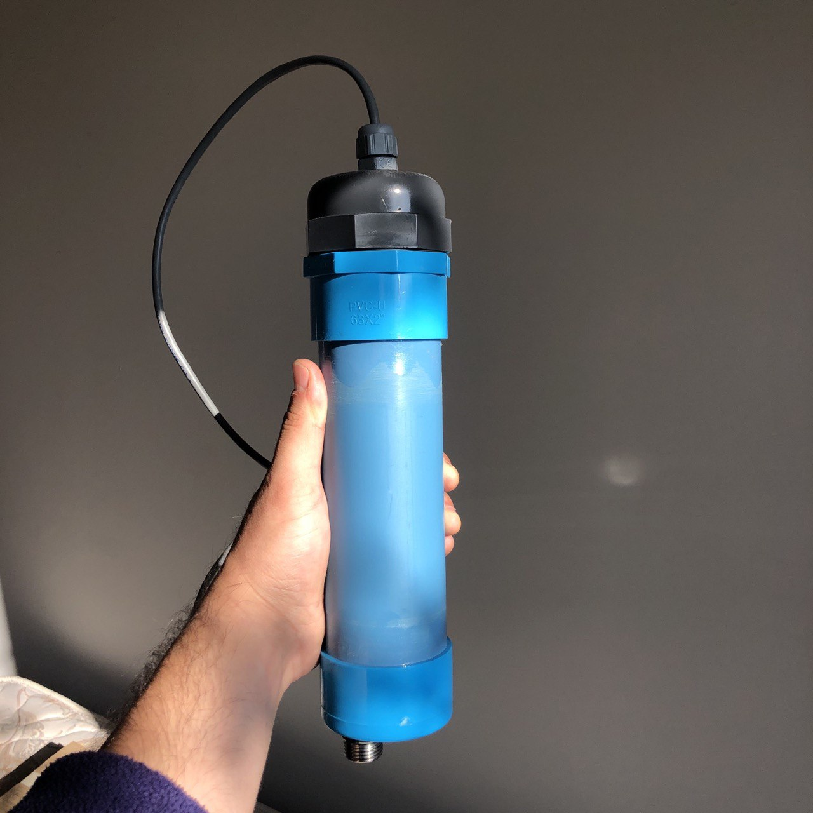
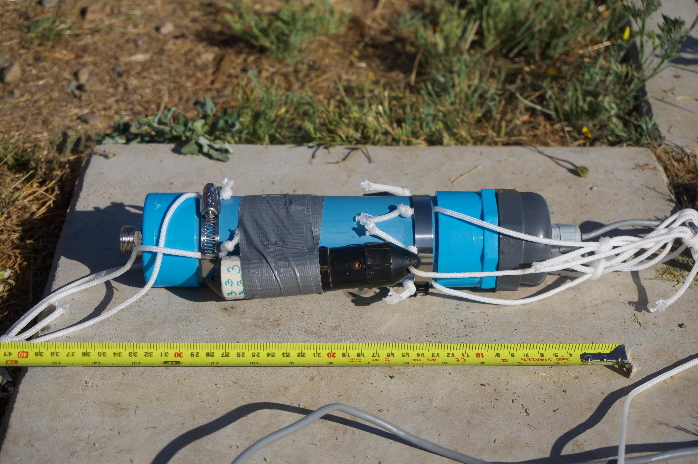
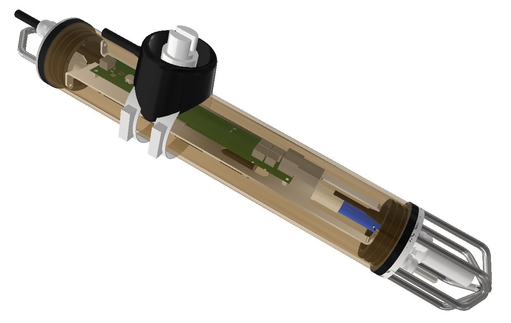
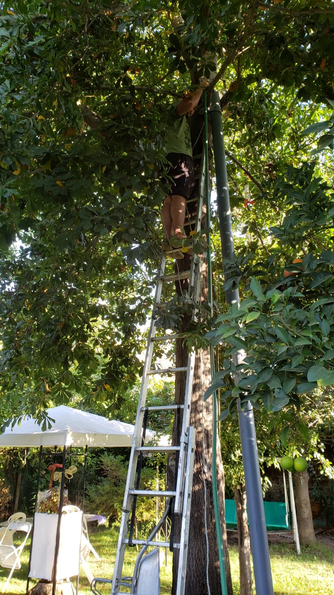
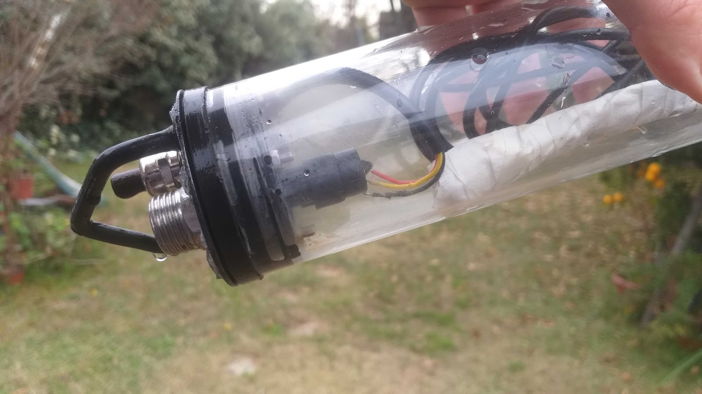
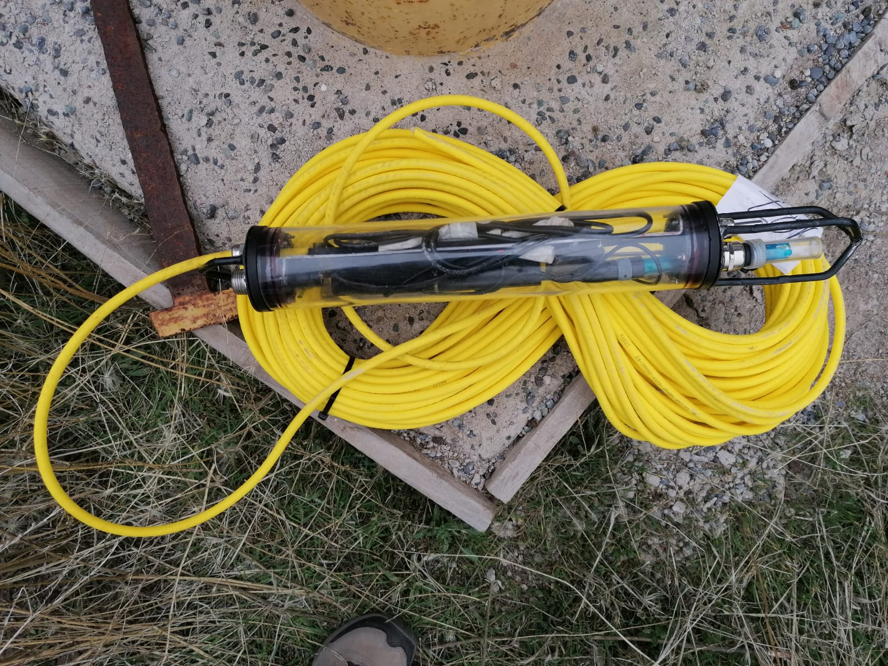
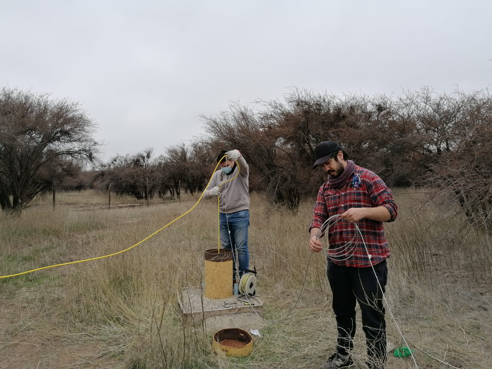
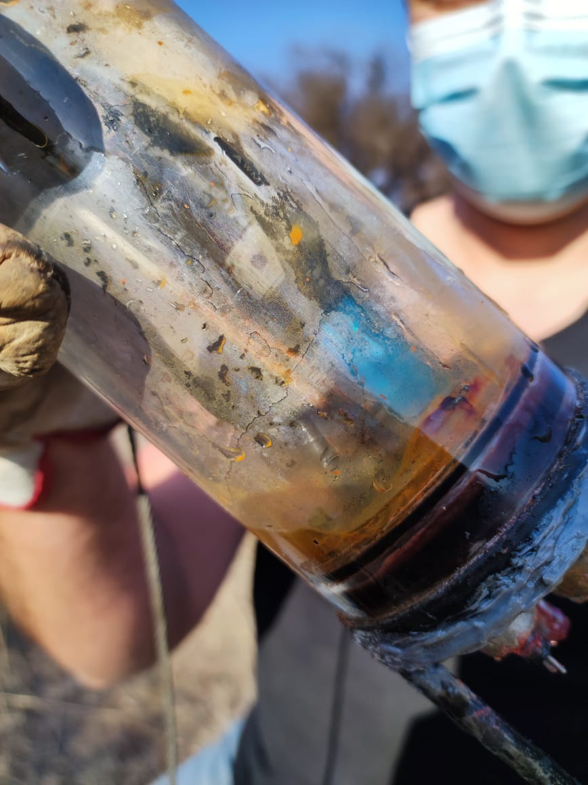
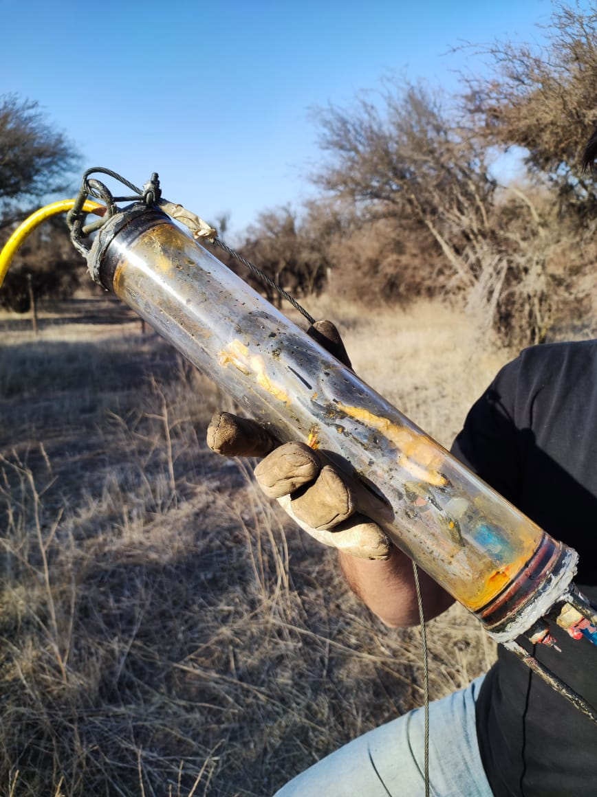

# 📦 Carcasa sumergible

Revisaremos el diseño y construcción de una carcasa incorporada al nodo sensor con factibilidad de ser desplegada en aguas superficiales y subterráneas. Se han realizado pruebas en ambiente controlado (laboratorio) sumergiendo la carcasa en tanques de agua por diferentes períodos de tiempo y evaluando efectividad en la protección del interior de acuerdo al grado de protección IP alcanzado (norma internacional CEI 60529 Degrees of Protection).

## Versión Preliminar

- funcionó un rato y filtró un poco de agua luego de 45 mins.
- se le puso arroz adentro.

## Directrices de diseño (”requerimientos”)
- Condiciones de uso

## Metodología: Diseño Orientado a la Manufactura (DfM)

(TODO: revisar bien.)

Design for Manufacturing o Diseño Orientado a la Manufactura, es una metodología de diseño que plantea principios fundamentales que guían las decisiones de diseño desde etapas tempranas del proceso creativo, con el objetivo de generar objetos o sistemas pensados para su fabricación, reduciendo así número de piezas, tiempos, costos, y recursos involucrados, para generar productos que respondan a los recursos disponibles en el proyecto de forma pertinente. En el Diseño Orientado a la Manufactura, se priorizan procesos y materiales disponibles de acuerdo a la escala de producción requerida, en el caso del nodo al ser un proyecto en etapa temprana, donde se prototipará a baja escala, se priorizará procesos locales y del menor costo posible. Además, la geometría de cada una de las piezas deberá ser diseñada para un proceso de fabricación en específico, priorizando piezas simétricas, además de utilizar piezas y componentes ya disponibles en el mercado para disminuir el número de piezas especiales a fabricar. Finalmente se deben escoger materiales que no solo cumplan con los requerimientos técnicos necesarios sino también que sean de bajo costo, y maquinables mediante los procesos de manufactura seleccionados. 

## Diseño intermedio +D

Una vez modelados los sensores y componentes, se comenzó a diseñar a nivel general el dispositivo, considerando los requerimientos establecidos previamente y priorizando materiales accesibles y disponibles en el mercado local. La geometría inicial contempla un tubo de acrílico transparente, tapas y un soporte interno para la electrónica, además de espacios laterales para la salida de los sensores y cable UTP, como se muestra en la Figura 11. Las tapas laterales (Figura 12) realizan el sello total del dispositivo en esta versión, mediante o`rings y fijándose al soporte interno que es lo que mantendrá las tapas a presión dentro del sistema.

IP69.  Además se incorporó al sistema un enganche (Figura 15) de acero inoxidable desde donde se anclará un mosquetón al momento del descenso, tanto en aguas superficiales como en aguas subterráneas.

Finalmente, se diseñó un sistema protector contra impactos al momento del descenso, en acero inoxidable.

Prototipado

Validaciones terreno

Resultados

Fabricación

- mayores dificultades, tipos de pruebas, desafíos.

Diseño final y partes

## Instrucciones armado

Manual (Adjunto)

## Resultados pruebas

Método de las pruebas

pruebas en tubo rancagua

pruebas en terreno

pruebas antes de llevar a terreno

Resumen de resultados y roadmap siguiente.

Comparación de costos cable vs cable nosotros.

- Tips
- Consejos
- Desafíos

Aprendizajes.
