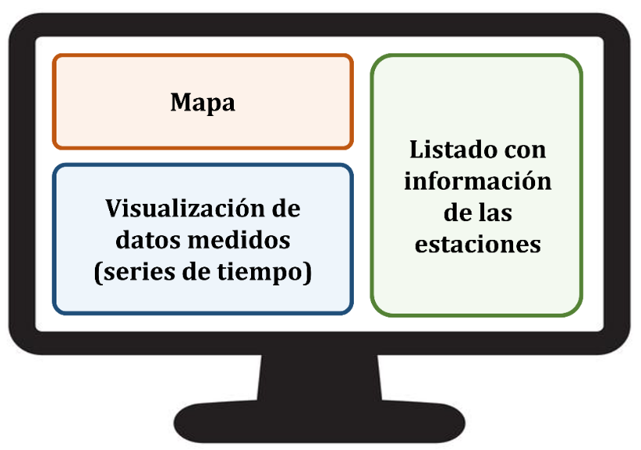
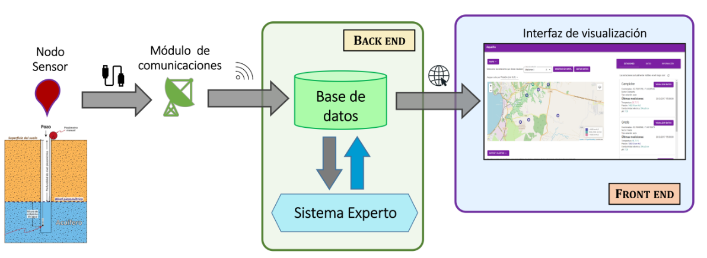
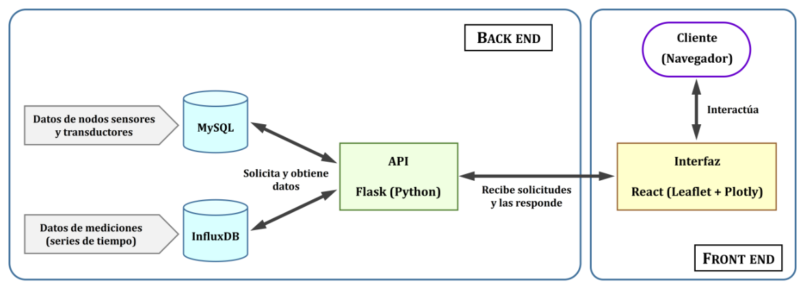

# 🚀 Interfaz Gráfica

## Diseño

El diseño de la interfaz gráfica desarrollada en el presente proyecto se delineó bajo 3 ejes principales: estructura de la interfaz gráfica, usabilidad, y experiencia de usuario. Estos ejes apuntan a desplegar la mayor información de interés para el usuario, permitiéndole interactuar con los datos medidos desde los acuíferos de una manera intuitiva y similar a otras plataformas existentes que cumplan los mismos propósitos.

### Estructura de la interfaz gráfica
La estructura que debe seguir la interfaz gráfica comprende 3 paneles principales que están interrelacionados entre sí, en la Figura 1 se muestra un esquema que ejemplifica estos 3 paneles mencionados.

Figura 1. Esquema de ejemplo distribución de los 3 paneles principales que constituyen la interfaz gráfica.

1. El primer panel debe incluir una cartografía en donde se presente un mapa con las estaciones geolocalizadas. Este mapa debe cumplir con ser interactivo, para que se puedan realizar operaciones de acercamiento o alejamiento, para ir a zonas específicas con el fin de ubicar las estaciones (nodos sensores).
2. El segundo panel, debe corresponder a un panel de visualización de datos, en donde se desplieguen las gráficas de las estaciones seleccionadas en el mapa. Las gráficas a su vez corresponderán a series de tiempo que muestren los datos medidos y almacenados de cada uno de los sensores instalados en las estaciones.
3. El tercer panel corresponde a un listado en el lado derecho de la interfaz gráfica con las estaciones que están visibles en el mapa. Además, este panel incluye una descripción geográfica de las estaciones, más los datos de las últimas mediciones de adquiridas. Dentro de este panel se agregan dos pestañas:
   * i) una pestaña para la descarga de datos, y
   * ii) una pestaña con una descripción del sistema de visualización (información que puede estar asociada a la versión de la interfaz gráfica, los/las desarrolladores involucrados, y/o formas de uso de la interfaz gráfica).

### Usabilidad

La interfaz gráfica requiere de un sistema interconectado de datos, es decir, cuando se selecciona una estación para visualizar sus estadísticas, éstas deben poder ser seleccionadas de distintas formas, por ejemplo, a través del mapa interactivo, como también, mediante un menú desplegable. Cualquiera de las formas de seleccionar las estaciones, debe hacer que se carguen los datos correspondientes. Una vez cargados los datos, se deben desplegar las gráficas con las series de tiempo de los datos medidos por los sensores de la estación.

El mapa interactivo, por su parte, puede tener la opción de cambiar su fondo, otorgando distintas perspectivas del despliegue de estaciones (visualización satelital, o visualización con un sistema de límites geo-políticos).

Se le debe proporcionar la mayor cantidad de información al usuario en cuanto a los datos medidos y almacenados en la base de datos, tanto a nivel temporal como espacial (comparación entre estaciones).

## Implementación interfaz gráfica

La implementación de la interfaz gráfica debe ser capaz de resolver distintos tipos de tareas, como por ejemplo, interactuar con un servidor que contiene aplicaciones, tener acceso a la base de datos que contiene los datos medidos por los sensores, desplegar la información necesaria para el usuario (o cliente) a través de algún software o aplicación web.

En el campo de la programación web, y “dependiendo del lugar” en donde se encuentren las tareas/aplicaciones, se definen los conceptos de back end y front end. El back end se refiere a todas las aplicaciones que están “del lado del servidor”, y por su parte el front end, se refiere a todas las aplicaciones que están “del lado del cliente” [3]. En el caso de la implementación de la interfaz gráfica desarrollada en el presente proyecto, el back end y el front end se resumen y ejemplifican en la Figura 2.

Figura 2. Ejemplo de lo que incluye el back end y el front end en la implementación de la interfaz gráfica

De acuerdo a lo anterior, la implementación de la interfaz gráfica apuntó a elaborar y configurar tanto el back end como el front end. El detalle de los softwares y aplicaciones utilizadas para el desarrollo de esta implementación se detallan a continuación y se resumen en la Figura 3.

Figura 3. Esquema de la implementación de la interfaz gráfica.

#### Front End

El front end fue desarrollado en React [4], que es una biblioteca de JavaScript [5] que ayuda a crear interfaces de usuario interactivas. Existen muchas librerías propias de React, que facilitan el uso de librerías JavaScript externas en un mismo ambiente. Para el caso de la implementación desarrollada en el presente proyecto, se utilizaron las librerías Leaflet [6] para visualizar e interactuar con el mapa, y Plotly.js [7] para mostrar los gráficos con sus interacciones. React se renderiza usando Node [8], que es un entorno de ejecución para JavaScript.

Versiones utilizadas:

 * React: v17.0.2
 * Leaflet: v1.7.1
 * Plotly.js: v2.2.1
 * Node: v12.18.3

#### Back End
La obtención de los datos de los sensores instalados en los acuíferos, se realizó a través de una interfaz de programación de aplicaciones (API, por sus siglas en inglés) desarrollada en Flask [9], que es un framework de desarrollo web escrito en Python [10]. La API se conecta con las bases de datos en MySQL [11] y en influxDB [12] y genera rutas de acceso que son posteriormente utilizadas en la interfaz web para obtener los datos solicitados. Esto permite que el front end pueda tener acceso a los datos cuando sea necesario, y de este modo, dejarlos a disposición del cliente.

Versiones utilizadas:
 * MySQL: v8.0.21
 * Influx: v1.8.3
 * Flask: v1.1.2
 * Python: v3.7.3

---

 * [3] “Front End vs. Back End: What’s the Difference?” https://kenzie.snhu.edu/blog/front-end-vs-back-end-whats-the-difference/ (accessed Jan. 14, 2022).
 * [4] “React. Una biblioteca de Javascript para construir interfaces de usuario.” https://es.reactjs.org/ (accessed Jan. 08, 2022).
 * [5] “JavaScript.” https://www.javascript.com/ (accessed Jan. 08, 2022).
 * [6] “Leaflet. An open-source JavaScript library for mobile-friendly interactive maps.” https://leafletjs.com/ (accessed Jan. 09, 2022).
 * [7] “Plotly JavaScript Open Source Graphing Library.” https://plotly.com/javascript/ (accessed Jan. 09, 2022).
 * [8] “Node.js.” https://nodejs.org/es/ (accessed Jan. 09, 2022).
 * [9] “Flask web development, one drop at a time.” https://flask.palletsprojects.com/en/2.0.x/ (accessed Jan. 09, 2022).
 * [10] “Python.” https://www.python.org/ (accessed Jan. 09, 2022).
 * [11] “MySQL The world’s most popular open source database.” https://www.mysql.com/ (accessed Jan. 10, 2022).
 * [12] “Act in Time. Build on InfluxDB. The platform for building time series applications.” https://www.influxdata.com/ (accessed Jan. 10, 2022).
