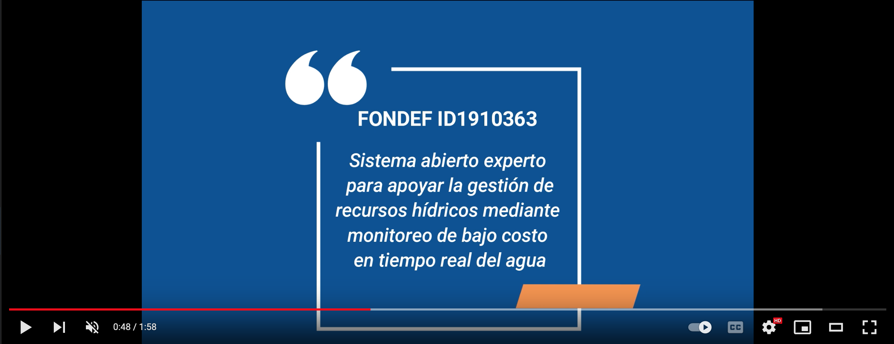

<h1 style="text-align:center;color:#000610"> Open Water: Fondef IDeA ID19I10363</h1>

<h5 style="text-align:center;color:DodgerBlue;"> Sistema abierto experto para apoyar la gestión de recursos hídricos mediante monitoreo de bajo costo en tiempo real de aguas superficiales y subterráneas </h5>

En enero del 2020 el consorcio formado por NIC Labs, el Departamento de Ingeniería Eléctrica y Geología de la Universidad de chile, y además empresas externas, propusieron diseñar y desarrollar un prototipo experimental con el objetivo de ligrar tener un sistema de medición multiparamétrico abierto, con el cual se pueda masificar el monitoreo de la calidad de agua tanto superficial como subterranea, con la adaptación de la tecnología de bajo costo.

La investigación científica es llevada a desarrollo mediante fondos otorgados por FONDEF ID19I10363.

 

<h2 style="text-align:center;color:#000610"> Noticias </h2>

 

<h2 style="text-align:center;color:#000610"> Equipo </h2>

 

<h2 style="text-align:center;color:#000610"> Licencia </h2>

 

<!--
<b>Editar bitacora</b>

Referirse a la página [como editar](old/como-editar.md).
-->
